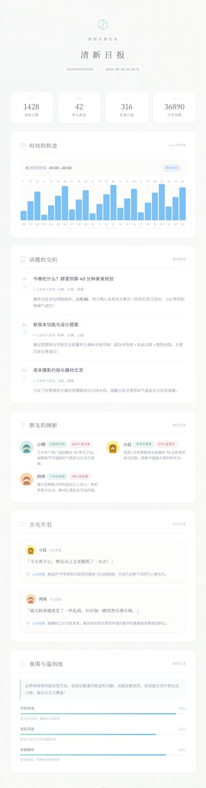
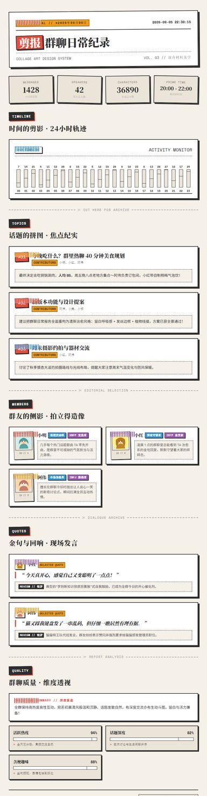

# 群聊日常分析 · 视觉主题模板库 (WarmDashboard)

本仓库是 [astrbot_plugin_qq_group_daily_analysis](https://github.com/SXP-Simon/astrbot_plugin_qq_group_daily_analysis) 插件的**官方/精选视觉主题模板库**。

仓库当前收录 **三套经过严苛无头渲染调优与完整端到端测试的高质量视觉风格模板**：

| 模板标识 | 风格名称 | 核心设计哲学与视觉特点 | 效果速览 |
| :--- | :--- | :--- | :---: |
| **`gda_warm_dashboard`** | **暖色仪表盘 (Warm Dashboard)** | 温暖舒适的珊瑚赤陶底色、奶油白大圆角卡片、漫反射柔光阴影，搭配青绿与金黄的高亮配色，营造亲和专业的数据仪表盘体验。 | [查看效果](#1-暖色仪表盘-gda_warm_dashboard) |
| **`gda_japanese_fresh`** | **日系清新风 (Japanese Fresh)** | 以「間 (Ma)」留白哲学与侘寂美学为核心，米白纸质纹理、发丝级淡雅边框、单株植物线描点缀，沉静治愈的呼吸感排版。 | [查看效果](#2-日系清新风-gda_japanese_fresh) |
| **`gda_collage_art`** | **拼贴艺术风 (Collage Art)** | 达达主义与波普艺术混合媒材，和纸胶带、微倾斜角度剪裁、撕纸边缘与混搭字体，充满手工质感与硬核视觉冲击。 | [查看效果](#3-拼贴艺术风-gda_collage_art) |

---

## 模板视觉展示

### 1. 暖色仪表盘 (`gda_warm_dashboard`)

> **设计核心**：珊瑚赤陶底色 (`#d4a088`)、奶油白圆角卡片 (`#faf8f5`)、柔和漫反射阴影 (`shadow-xl shadow-black/8`)、青绿 (`#4a9d9a`) 与金黄 (`#e8b86d`) 数据图表点缀。


* 完整无损高清长图：[assets/gda_warm_dashboard-demo.jpg](assets/gda_warm_dashboard-demo.jpg)

---

### 2. 日系清新风 (`gda_japanese_fresh`)

> **设计核心**：米白底色 (`#fafaf8`) 结合和纸微肌理、极细发丝级中性边框 (`border-[#d4d4cf]/40`)、植物线描装饰图标、治愈系天青 (`#64b5f6`) 与薄荷绿 (`#98d8c8`) 柔和渐变。



* 完整无损高清长图：[assets/gda_japanese_fresh-demo.jpg](assets/gda_japanese_fresh-demo.jpg)

---

### 3. 拼贴艺术风 (`gda_collage_art`)

> **设计核心**：陈旧纸张底色 (`#f5f0e8`)、纯色实线边框 (`border-2 border-[#2d2d2d]`)、硬偏移纯色阴影 (`shadow-[5px_5px_0px_#2d2d2d]`)、彩色和纸胶带条纹 (`repeating-linear-gradient`)、轻微角度旋转、杂志剪贴与拍立得混搭排版。



* 完整无损高清长图：[assets/gda_collage_art-demo.jpg](assets/gda_collage_art-demo.jpg)

---

> 📌 **图片资产规范说明**：
> - `assets/*-demo-thumb.jpg` —— 本 README 展示用的缩略图（宽度 384~420px），用于仓库首页快速预览。
> - `assets/*-demo.jpg` —— 完整长图（750px 宽无损高质），供查看全部排版与细节。
> - `<template_name>/preview.jpg` —— 随模板打包随行的模板预览图：用户在 AstrBot 中使用 QQ `查看模板` 命令或进入插件 WebUI 模板画廊时，将即时显示该图。
>
> 均可通过根目录脚本 `python generate_preview.py` 一键自动生成。

---

## 一键安装与使用

### 方式一：Web 控制台一键拉取（推荐）

1. 打开 AstrBot 插件 Web 控制台 → **群聊日常分析配置页**。
2. 在模板选择器旁点击 **「安装模板」** → 切换至 **「GitHub / Git 仓库安装」** 标签页。
3. 填入本仓库地址：
   ```text
   https://github.com/SXP-Simon/WarmDashboard
   ```
4. 点击安装。插件内置安装器会自动拉取源码并识别仓库内的所有模板目录（`gda_warm_dashboard/`、`gda_japanese_fresh/`、`gda_collage_art/`），完成校验与注册，**全程热加载，无需重启机器人**。

### 方式二：下载 ZIP 手动上传

1. 在本 GitHub 仓库页面点击 **`Code` ▾ → `Download ZIP`**。
2. 进入插件管理面板的 **「安装模板 → 上传 ZIP」**，上传下载的压缩包即可。

> 💡 **使用提示**：
> - 安装成功后，新模板将即刻出现在**「报告模板选择」**、**「断点续跑」**与**「免 Token 切换主题重绘」**的下拉菜单中。
> - 如需卸载，直接在同一入口旁的「卸载模板」列表中点击删除（内置模板不可卸载）。

---

## 仓库目录结构

```text
WarmDashboard/
├── README.md                      # 仓库综合说明文档（三套视觉风格展示与索引）
├── AGENTS.md                      # 三套完整设计系统规范 (Japanese Fresh & Warm Dashboard & Collage Art)
├── gda_warm_dashboard/            # [模板一] 暖色仪表盘 (Warm Dashboard)
│   ├── image_template.html        # 长图海报主骨架 (750px Headless 优化)
│   ├── html_template.html         # 独立网页主骨架 (移动/桌面自适应响应式)
│   ├── topic_item.html            # 话题列表子组件
│   ├── user_title_item.html       # 群友称号与侧影子组件
│   ├── quote_item.html            # 金句与锐评子组件
│   ├── activity_chart.html        # 24h 活跃度柱状图子组件
│   ├── chat_quality_item.html     # 群聊质量多维锐评子组件
│   ├── template.json              # 模板元数据与能力声明
│   └── preview.jpg                # 模板内置缩略预览图
├── gda_japanese_fresh/            # [模板二] 日系清新风 (Japanese Fresh)
│   ├── image_template.html        # 长图海报主骨架
│   ├── html_template.html         # 独立网页主骨架
│   ├── topic_item.html            # 话题列表子组件（带植物叶片线描）
│   ├── user_title_item.html       # 群友侧影子组件
│   ├── quote_item.html            # 金句子组件（虚线极简微光卡片）
│   ├── activity_chart.html        # 24h 活跃度柱状图子组件（发丝底槽）
│   ├── chat_quality_item.html     # 群聊质量多维子组件
│   ├── template.json              # 模板元数据与能力声明
│   └── preview.jpg                # 模板内置缩略预览图
├── gda_collage_art/               # [模板三] 拼贴艺术风 (Collage Art)
│   ├── image_template.html        # 拼贴艺术长图海报主骨架
│   ├── html_template.html         # 响应式网页主骨架 (含纸片掀起/胶带视差动效)
│   ├── topic_item.html            # 话题子组件（和纸胶带与撕纸剪报感）
│   ├── user_title_item.html       # 群友拍立得拍立造像子组件
│   ├── quote_item.html            # 金句锐评撕纸卡片子组件
│   ├── activity_chart.html        # 24h 轨迹柱状图子组件（对比硬边条纹）
│   ├── chat_quality_item.html     # 群聊质量深度复盘子组件
│   ├── template.json              # 模板元数据与能力声明
│   └── preview.jpg                # 模板内置缩略预览图
├── assets/                        # 文档与 Releases 高清演示素材
├── generate_preview.py            # 跨平台无头浏览器预览生成脚本
└── verify_demo.py                 # Jinja2 语法、严格渲染与安装器端到端测试脚本
```

---

## 视觉规范与自定义

每个模板的视觉变量均高度解耦，集中在各自 `image_template.html` / `html_template.html` 顶部的 `:root { ... }` 中：

### 暖色仪表盘关键 Token (`gda_warm_dashboard`)
```css
:root {
    --bg-terracotta: #d4a088;        /* 主背景珊瑚赤陶色 */
    --card-cream: #faf8f5;           /* 卡片奶油白 */
    --accent-teal: #4a9d9a;          /* 主强调青绿色 */
    --accent-gold: #e8b86d;          /* 图表金黄色 */
    --accent-coral: #c17767;         /* 次要强调珊瑚红 */
    --text-main: #1f2937;            /* 深灰文本 text-gray-800 */
    --radius-main: 28px;             /* 大圆角 */
}
```

### 日系清新风关键 Token (`gda_japanese_fresh`)
```css
:root {
    --bg-rice: #fafaf8;              /* 和纸米白底色 */
    --bg-card: #ffffff;              /* 卡片纯白 */
    --sky-blue: #64b5f6;             /* 晴空蓝强调色 */
    --mint-green: #98d8c8;           /* 薄荷绿强调色 */
    --gentle-pink: #ffb7c5;          /* 柔粉点缀色 */
    --text-main: #4a5568;            /* 炭灰正文 */
    --text-secondary: #7a8a9e;       /* 次要文案色 */
    --border-hairline: rgba(212, 212, 207, 0.4); /* 发丝级边框 */
    --radius-gentle: 18px;           /* 柔和微圆角 */
}
```

### 拼贴艺术风关键 Token (`gda_collage_art`)
```css
:root {
    --bg-paper: #f5f0e8;             /* 陈旧纸张底色 */
    --bg-paper-alt: #ebe4d8;         /* 次级泛黄纸张色 */
    --card-white: #ffffff;           /* 纯白剪切色 */
    --charcoal: #2d2d2d;             /* 深炭灰边框与主文字 */
    --cut-red: #e74c3c;              /* 剪切红 */
    --magazine-blue: #3498db;        /* 杂志蓝 */
    --paste-yellow: #f39c12;         /* 粘贴黄 */
    --fragment-purple: #9b59b6;      /* 碎片紫 */
    /* 核心风格规则：全直角 rounded-none、硬偏移阴影 shadow-[5px_5px_0px_#2d2d2d]、和纸条纹胶带 */
}
```

> 详细的 Tailwind Token 字典、绝对禁止规则（Forbidden）与 Hard Prompt 请查阅 [AGENTS.md](AGENTS.md)。

---

## 自动化测试与预览工具

本仓库自带完备的本地校验工具，方便二次开发与定制：

```bash
# 1) 语法与多模板严格渲染校验（若传入插件路径，还会测试打包→安装→卸载端到端）
python verify_demo.py
# 或传入插件根目录进行完整联调测试：
python verify_demo.py path/to/astrbot_plugin_qq_group_daily_analysis

# 2) 重新生成所有模板的预览长图与缩略图（依赖本地 Chrome 或 Edge）
python generate_preview.py

# 也可以仅为特定模板生成：
python generate_preview.py gda_collage_art
```

---

## 许可证

[MIT License](LICENSE)
