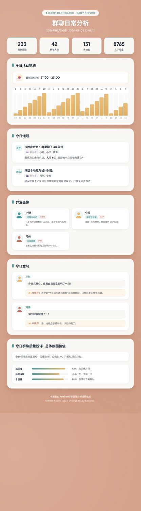

# 群聊日常分析 · 报告视觉模板（暖色仪表盘 Warm Dashboard）

本仓库是 [astrbot_plugin_qq_group_daily_analysis](https://github.com/SXP-Simon/astrbot_plugin_qq_group_daily_analysis) 的 **报告视觉模板仓库**。

内置模板：**`gda_warm_dashboard`（暖色仪表盘 Warm Dashboard）** —— 温暖舒适的珊瑚赤陶色背景、奶油白大圆角卡片、柔和漫射阴影，搭配青绿与金黄点缀，打造舒适专业的数据可视化体验。

> 预览：
> 
>
> 完整长图见 [assets/gda_warm_dashboard-demo.jpg](assets/gda_warm_dashboard-demo.jpg)。

> 📌 **图片文件说明**：
> - `assets/gda_warm_dashboard-demo-thumb.jpg` —— **本 README 展示用的缩略图**（宽 420），用于仓库首页快速预览效果。
> - `assets/gda_warm_dashboard-demo.jpg` —— **完整长图**（750 宽无损高质），供查看全部细节。
> - `gda_warm_dashboard/preview.jpg` —— **随模板打包的预览图**：用户安装本模板后，QQ `/查看模板` 与 WebUI 画廊显示的就是该图。
>
> 三者均由 `generate_preview.py` 一次生成。

## 一键安装（推荐）

在插件 Web 控制台 → 配置页 → 模板选择器旁「安装模板」→ GitHub 链接标签页：

```
https://github.com/SXP-Simon/WarmDashboard
```

插件会自动下载源码、识别 `gda_warm_dashboard/` 模板目录并安装，**无需重启机器人**。
也可以在本仓库页面点 `Code ▾ → Download ZIP`，然后在「安装模板 → 上传 zip」直接上传。

> 安装成功后模板会出现在「断点续跑」「免 Token 切换主题重绘」下拉中；
> 卸载请用同一入口旁的「卸载模板」（内置模板不可卸载）。

## 目录结构

```
WarmDashboard/
├── README.md                # 本说明
├── AGENTS.md                # AI 与模板开发规范
├── gda_warm_dashboard/      # 模板根目录（zip 打包时打包这一层）
│   ├── image_template.html  # 长图海报主骨架（750px）
│   ├── html_template.html   # 独立网页主骨架（响应式）
│   ├── topic_item.html      # 话题列表模块
│   ├── user_title_item.html # 群友称号与画像模块
│   ├── quote_item.html      # 金句与锐评模块
│   ├── activity_chart.html  # 24h 活跃轨迹模块
│   ├── chat_quality_item.html # 群聊质量锐评模块
│   └── template.json        # 模板显示元信息
├── assets/                  # 预览图与素材
├── generate_preview.py      # 本地预览图渲染脚本
└── verify_demo.py           # 模板语法与安装端到端校验脚本
```

## 设计规范与配色系统

本模板严格遵循 **Warm Dashboard（暖色仪表盘）** 设计系统规范：

| 角色 | 色值 / Class | 用途 |
| --- | --- | --- |
| **背景主色** | `#d4a088` (珊瑚/赤陶) | 页面整体温暖底色 |
| **背景辅色** | `#faf8f5` (奶油白) | 主内容卡片背景 |
| **卡片内层** | `#ffffff` (纯白) | 卡片内部小组件与气泡 |
| **主要强调色** | `#4a9d9a` (青绿) | 主强调、徽章、正向数据高亮 |
| **图表强调色** | `#e8b86d` (金黄) | 柱状图、峰值高亮、统计重点 |
| **次要强调色** | `#c17767` (珊瑚红) | 警示、MBTI 标签、锐评强调 |
| **辅助修饰色** | `#6b8e8e` (灰绿) | 次要元素与辅助边框 |
| **正文主色** | `#1f2937` (深灰 text-gray-800) | 标题与重点文字 |
| **正文次色** | `#4b5563` (中灰 text-gray-600) | 正文描述文字 |
| **底色文字** | `#ffffff` (纯白) | 暖色底色上的大标题与日期 |

### 视觉特性
- **大圆角**：卡片采用 `24px` (`rounded-3xl`) 大圆角，内部组件采用 `16px` (`rounded-2xl`)。
- **漫射阴影**：柔和自然的扩散阴影 `0 16px 32px -4px rgba(0, 0, 0, 0.08)`，杜绝硬边阴影。
- **精致微交互**：网页端卡片悬停轻微上浮 `hover:-translate-y-0.5`，图表悬浮柔光反馈。

## 快速自定义

所有视觉均由 `gda_warm_dashboard/image_template.html` 头部 `:root { ... }` 的 CSS 变量控制：

```css
:root {
    --bg-warm: #d4a088;        /* 主背景珊瑚赤陶色 */
    --card-cream: #faf8f5;     /* 卡片奶油白 */
    --accent-teal: #4a9d9a;    /* 主要强调青绿色 */
    --accent-gold: #e8b86d;    /* 图表金黄色 */
    --accent-coral: #c17767;   /* 次要强调珊瑚色 */
    --text-primary: #1f2937;   /* 主文字深灰 */
    --text-secondary: #4b5563; /* 次要文字 */
    --radius-card: 24px;       /* 主卡片圆角 */
}
```

## 自检与预览脚本

仓库根提供 `verify_demo.py` 与 `generate_preview.py`：

```bash
# 1) 校验模板语法与严格运行时渲染
python verify_demo.py

# 2) 生成高质预览截图与缩略图
python generate_preview.py
```

## 许可

MIT License
